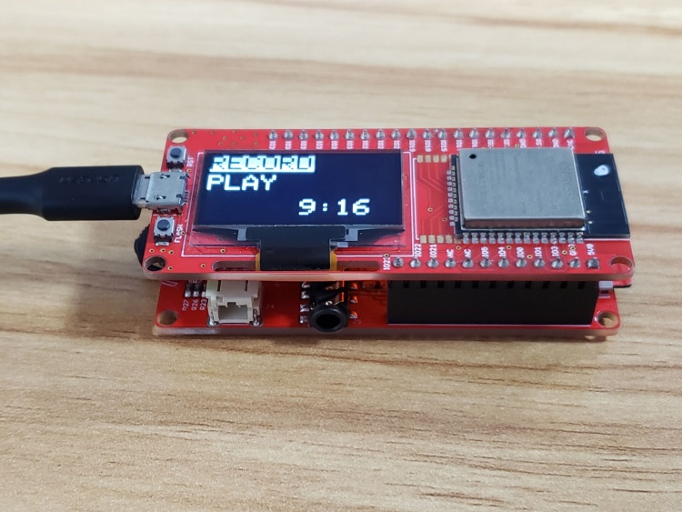
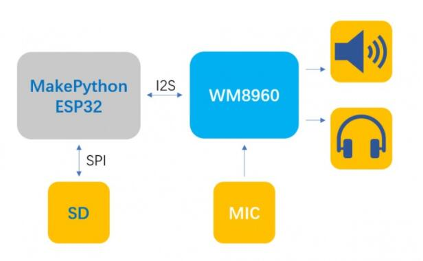
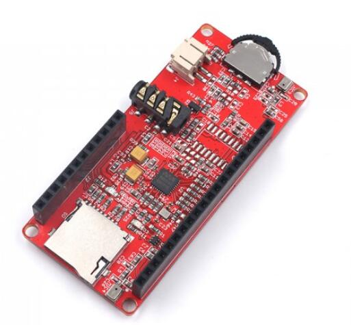
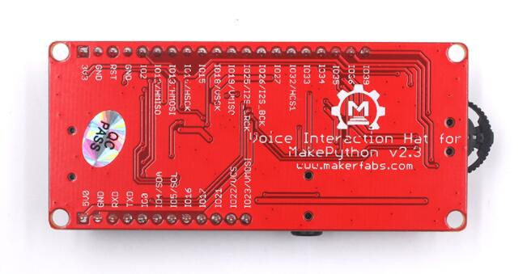

# ESP32 Voice Interaction

```c++
/*
Version:		V1.3
Author:			Vincent
Create Date:	2020/10/16

Note:
		2020/12/24 v1.3: Update readme.
		v1.2 Add Interphone example.
		v1.1 Add Record & Play example.
		
*/
```

[toc]



# Makerfabs

[Makerfabs home page](https://www.makerfabs.com/)

[Makerfabs Wiki](https://makerfabs.com/wiki/index.php?title=Main_Page)


# ESP32 Voice Interaction Hat

## Intruduce

Product Link ：[Voice Interaction Hat for Makepython](https://www.makerfabs.com/voice-interaction-hat-for-makepython.html) 

Wiki Link :  [Voice_Interaction_Hat_for_MakePython](https://wiki.makerfabs.com/Voice_Interaction_Hat_for_MaESP_ESP32.html) 


ESP32 Voice Interaction is an extended version with speakers and mics. The audio IC is WM8960. It has a button, SD card slot and a headphone jack.  It is convenient to produce MP3, interphone, recording pen and other items. 



The two functions of recording pen and walkie-talkie are realized. The recorder pen provides a simple menu for selecting play and recording. A UDP walkie-talkie can talk to any device under the same WIFI.

## Feature

- Micro SD card slot on board.

### Front:



### Back:


# Example

## Equipment list

- [MakePython ESP32](https://www.makerfabs.com/open-hardware/maboards/maesp.html)
- [MakaPython Voice Interaction Hat](https://www.makerfabs.com/voice-interaction-hat-for-makepython.html)
- Micro SD card (Part of the project)

## Compiler Options

**If you have any questions，such as how to install the development board, how to download the code, how to install the library. Please refer to :[Makerfabs_FAQ](https://github.com/Makerfabs/Makerfabs_FAQ)**

- Install board : ESP32 .
- Install library : Adafruit_GFX library.
- Install library : Adafruit SSD1306.

- Insert a Micro SD card into ESP32 Touch Camera.
- Upload codes, select "ESP32 Wrover Module" and "Huge APP"

## Example List

### ESP32_Record_Play
A recorder with a simple menu.

- Insert SD card.
- Upload code to ESP32.
- Restart ESP32.


### ESP32_Interphone
UDP protocol LAN walkie-talkie.

- Prepare two or more ESP32 and Voice Hat.
- Set WIFI ssid and password.
- Upload code to ESP32.
- Restart ESP32.
- Press the left button to speak, and others will play.

### wav_play
Test code, don't use. It can play wav file, but need a specific format.

### record
Record 5 second sound and playback.
- Insert SD card.
- Upload code to ESP32.
- Restart ESP32.
- Press the left button to start recording, recording will end at 5S.
- After the recording is over, the player will play the recording.
